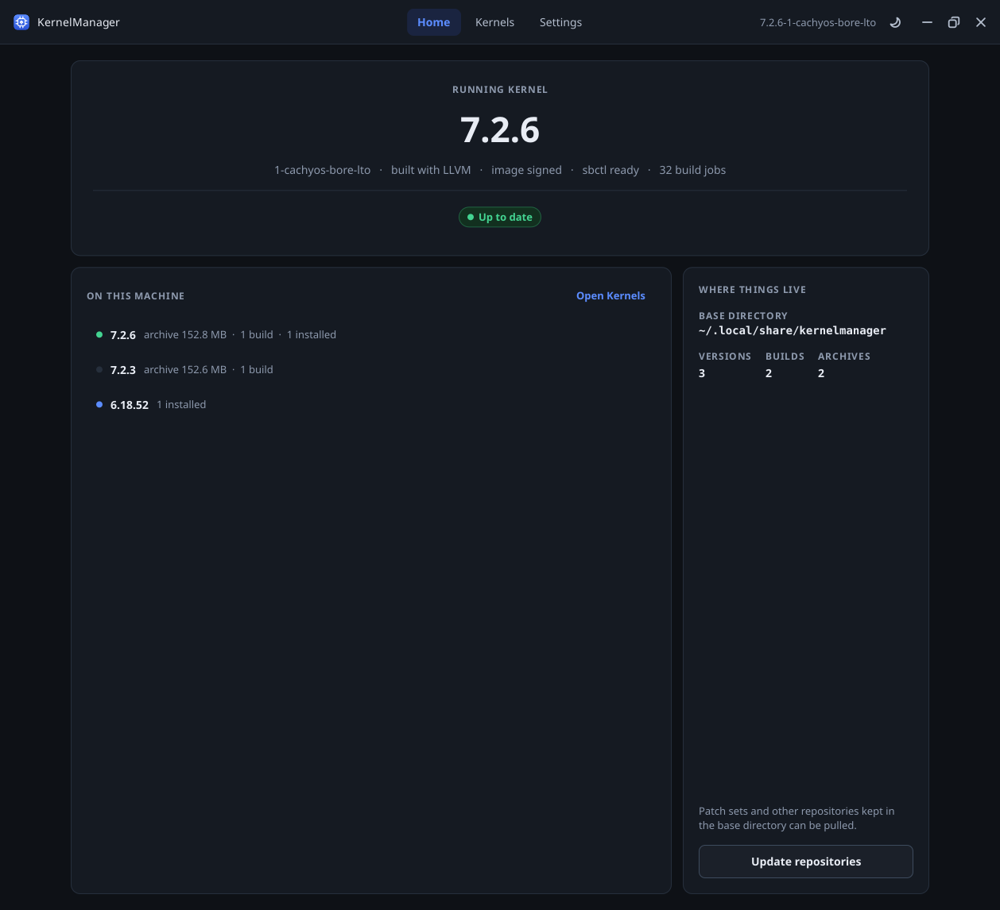
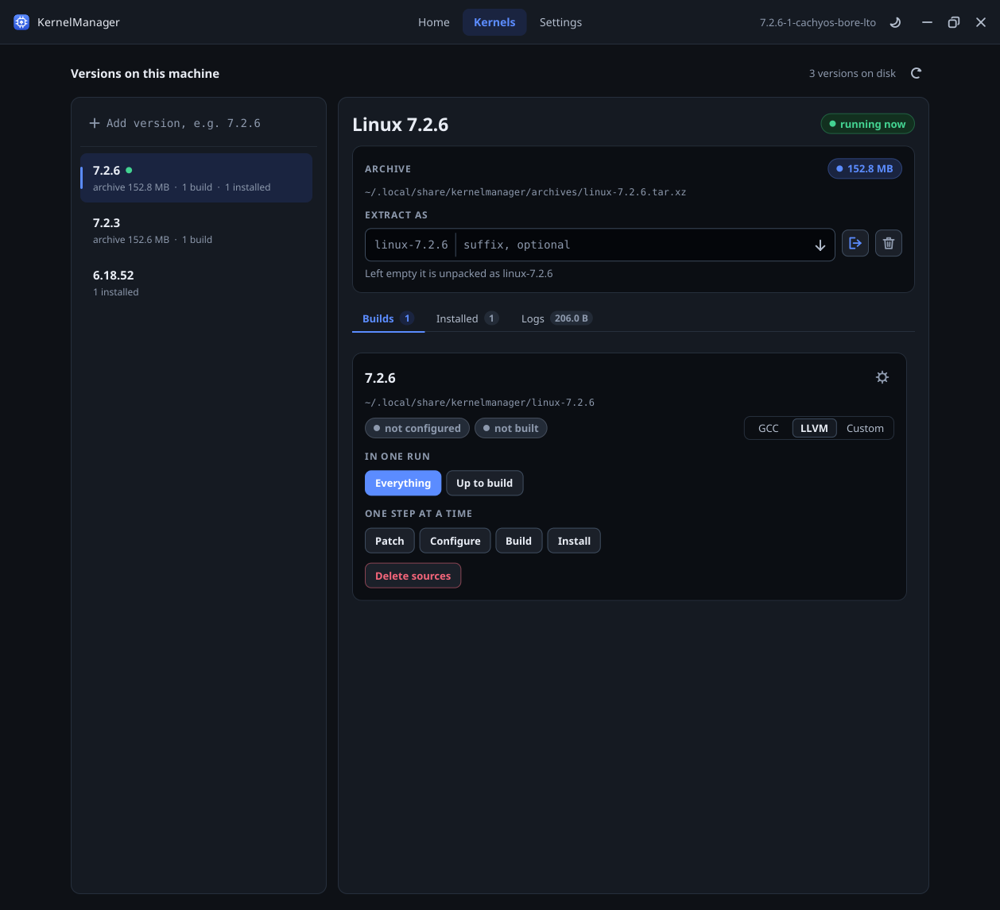

# kernelmgr

Downloads, patches, configures, builds and installs kernels from kernel.org.
Comes as a GUI (`KernelManager`) and a CLI (`kmgr`).

## Build

Needs a C++23 compiler, CMake 3.25+, libcurl, libarchive and libdbus-1. First configure needs github.com access.

```sh
cmake -B build -DCMAKE_BUILD_TYPE=Release
cmake --build build -j$(nproc)
```

Binaries land in `build/bin`. Options:

- `-DGUI=OFF` skips the GUI
- `-DFETCHCONTENT_SOURCE_DIR_TINYTK=/path/to/tinytk` uses a local tinytk
- `TTK_DOWNLOAD_CACHE` moves the fetch cache (default `.download-cache`)

## GUI

| Home | Kernels |
|------|---------|
|  |  |
| Running kernel, update check, one-click autoupdate | Download, extract, patch, configure, build, install per version |

Steps needing root prompt for a password once per session.

## CLI

```sh
kmgr --help
kmgr -k 6.14.4 -s custom --install    # download, build and install 6.14.4-custom
kmgr -K 6.14.3 -k 6.14.4 -s custom    # same, then remove 6.14.3-custom
kmgr -k 6.14.4 --download             # download, extract and patch only
kmgr -k 6.14.4 --resume --install     # build and install an extracted kernel
kmgr -k 6.14.4 --clean=all            # remove every trace of a kernel
kmgr --autoupdate                     # update to the latest release
```

Logs go to `<base>/logs/<version>/<step>/`.

## Configuration

Settings: `$XDG_CONFIG_HOME/kernelmanager/config.json` (optional, editable from the GUI).
`--gcc`, `--clang` and `--custom` override the toolchain for one run. `custom` passes `customFlags` to make.

Files looked up in the base directory (the suffixed name applies to suffixed builds):

| File | Example | Fallback |
|------|---------|----------|
| Kernel config | `6.14-custom.config`, `6.14.config` | running kernel's config |
| Patch list | `6.14-custom-patch.txt`, `6.14-patch.txt` | no patching |

A patch list names the patch directory on line one, then one patch (wildcards allowed) per line:

```
home/user/.local/share/kernelmanager/patches
*first.patch
folder/*second.patch
```

`--patch script.sh` runs a script from the kernel directory instead. `--revert` undoes list-applied patches.
